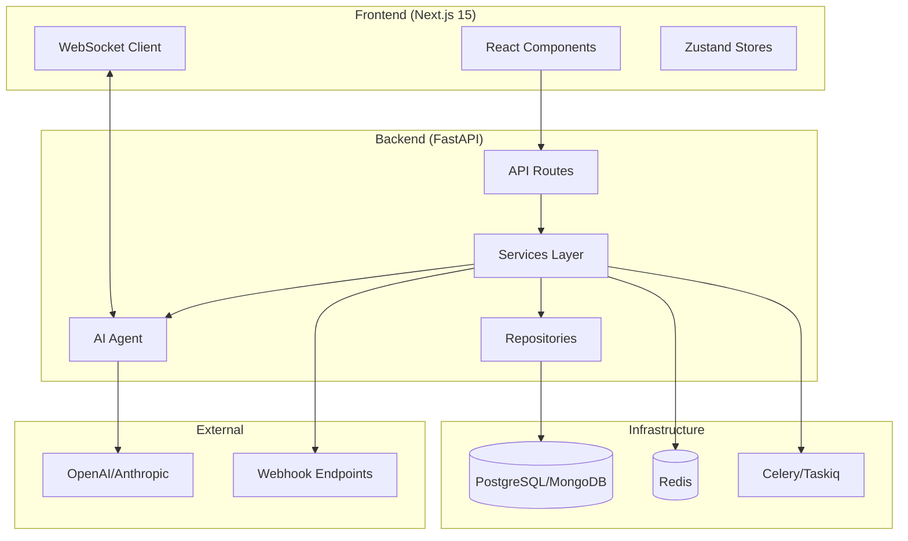
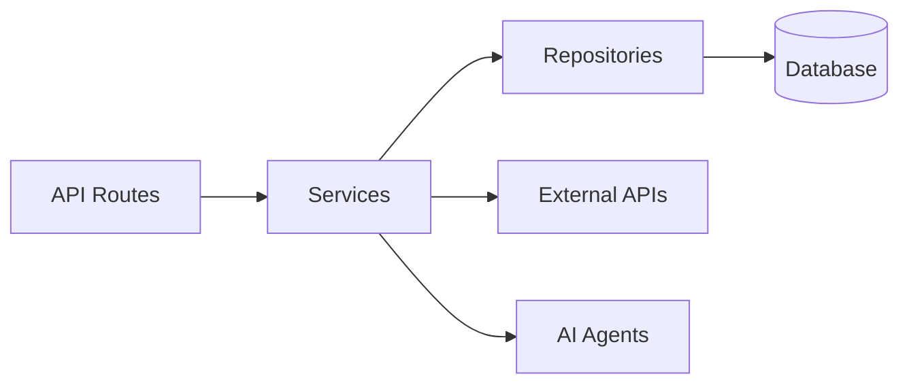
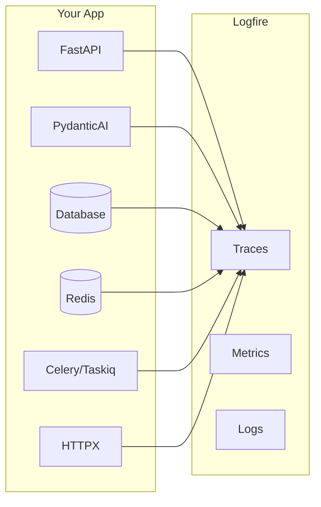

<p align="center">
  
</p>

<h1 align="center">Full-Stack AI Agent Template</h1>

<p align="center">
  <i>Production-ready FastAPI + Next.js project generator with AI agents, RAG, and 20+ enterprise integrations.</i>
</p>

<p align="center">
  <a href="#-quick-start">Quick Start</a> •
  <a href="#-features">Features</a> •
  <a href="#-demo">Demo</a> •
  <a href="https://vstorm-co.github.io/full-stack-ai-agent-template/">Documentation</a> •
  <a href="https://oss.vstorm.co/projects/full-stack-ai-agent-template/configurator/">Configurator</a> •
  <a href="https://pypi.org/project/fastapi-fullstack/">PyPI</a>
</p>

<p align="center">
  <a href="https://pypi.org/project/fastapi-fullstack/"></a>
  <a href="https://pepy.tech/projects/fastapi-fullstack"></a>
  <a href="https://github.com/vstorm-co/full-stack-ai-agent-template/stargazers"></a>
  <a href="https://www.python.org/"></a>
  <a href="https://github.com/vstorm-co/full-stack-ai-agent-template/blob/main/LICENSE"></a>
  
  <a href="https://github.com/vstorm-co/full-stack-ai-agent-template/actions/workflows/ci.yml"></a>
  <a href="https://github.com/vstorm-co/full-stack-ai-agent-template/blob/main/SECURITY.md"></a>
  <a href="https://www.bestpractices.dev/projects/12539"></a>
  <a href="https://github.com/pydantic/pydantic-ai"></a>
  <a href="https://x.com/Kacper95682155"></a>
</p>

<p align="center">
  <b>🤖 6 AI Agent Frameworks</b> <i>(PydanticAI, PydanticDeep, LangChain, LangGraph, CrewAI, DeepAgents)</i>
  <br>
  <b>📄 RAG Pipeline</b> <i>(Milvus, Qdrant, pgvector, ChromaDB)</i>
  <br>
  <b>⚡ FastAPI + Next.js 15</b> <i>(WebSocket streaming, real-time chat UI)</i>
  <br>
  <b>🔗 Conversation Sharing</b> <i>(direct sharing, public links, admin browser)</i>
  <br>
  <b>🔒 Enterprise-Ready</b> <i>(JWT, OAuth, admin panel, Celery, Docker, K8s)</i>
</p>

<details>
<summary><b>Table of Contents</b></summary>

- [Quick Start](#-quick-start)
- [Demo](#-demo)
- [Screenshots](#-screenshots)
- [Why This Template](#-why-this-template)
- [Features](#-features)
- [Architecture](#-architecture)
- [AI Agent](#-ai-agent)
- [RAG](#-rag-retrieval-augmented-generation)
- [Observability](#-observability)
- [Django-style CLI](#-django-style-cli)
- [Generated Project Structure](#-generated-project-structure)
- [Configuration Options](#-configuration-options)
- [Comparison](#-comparison)
- [FAQ](#-faq)
- [Documentation](#-documentation)
- [Contributing](#-contributing)

</details>

---

## Vstorm OSS Ecosystem

This template is part of a broader open-source ecosystem for production AI agents:

| Project | Description | |
|---------|-------------|---|
| **[pydantic-deepagents](https://github.com/vstorm-co/pydantic-deepagents)** | The modular agent runtime for Python. Claude Code-style CLI with Docker sandbox, browser automation, multi-agent teams, and /improve. | [](https://github.com/vstorm-co/pydantic-deepagents) |
| **[pydantic-ai-shields](https://github.com/vstorm-co/pydantic-ai-shields)** | Drop-in guardrails for Pydantic AI agents. 5 infra + 5 content shields. | [](https://github.com/vstorm-co/pydantic-ai-shields) |
| **[pydantic-ai-subagents](https://github.com/vstorm-co/pydantic-ai-subagents)** | Declarative multi-agent orchestration with token tracking. | [](https://github.com/vstorm-co/pydantic-ai-subagents) |
| **[summarization-pydantic-ai](https://github.com/vstorm-co/pydantic-ai-summarization)** | Smart context compression for long-running agents. | [](https://github.com/vstorm-co/summarization-pydantic-ai) |
| **[pydantic-ai-backend](https://github.com/vstorm-co/pydantic-ai-backend)** | Sandboxed execution for AI agents. Docker + Daytona. | [](https://github.com/vstorm-co/pydantic-ai-backend) |

> **Want the runtime behind this template's AI agents?** [pydantic-deepagents](https://github.com/vstorm-co/pydantic-deepagents) powers the `deepagents` framework option — install it standalone with `curl -fsSL .../install.sh | bash`.

Browse all projects at [oss.vstorm.co](https://oss.vstorm.co)

---

## 🚀 Quick Start

> [!TIP]
> **Prefer a visual configurator?** Use the [Web Configurator](https://oss.vstorm.co/projects/full-stack-ai-agent-template/configurator/) to configure your project in the browser and download a ZIP — no CLI installation needed.

### Installation

```bash
# pip
pip install fastapi-fullstack

# uv (recommended)
uv tool install fastapi-fullstack

# pipx
pipx install fastapi-fullstack
```

### Create Your Project

```bash
# Interactive wizard (recommended — runs by default)
fastapi-fullstack

# Quick mode with options
fastapi-fullstack create my_ai_app \
  --database postgresql \
  --frontend nextjs

# Use presets for common setups
fastapi-fullstack create my_ai_app --preset production   # Full production setup
fastapi-fullstack create my_ai_app --preset ai-agent     # AI agent with streaming

# Minimal project (no extras)
fastapi-fullstack create my_ai_app --minimal
```

### Start Development (Docker — recommended)

The fastest way to get running — 2 commands:

```bash
cd my_ai_app
make docker-up       # Start backend + database + migrations + admin user
make docker-frontend # Start frontend
```

**Access:**

- API: <http://localhost:8000>
- Docs: <http://localhost:8000/docs>
- Admin Panel: <http://localhost:8000/admin>
- Frontend: <http://localhost:3000>

> [!TIP]
> That's it. Docker handles database setup, migrations, and admin user creation automatically.

<details>
<summary><b>Manual setup (without Docker)</b></summary>

#### 1. Install dependencies

```bash
cd my_ai_app
make install
```

> [!NOTE]
> **Windows Users:** The `make` command requires GNU Make which is not available by default on Windows.
> Install via [Chocolatey](https://chocolatey.org/) (`choco install make`), use WSL, or run raw commands manually.
> Each generated project includes a "Manual Commands Reference" section in its README with all commands.

#### 2. Start the database

```bash
# PostgreSQL (with Docker)
make docker-db
```

#### 3. Create and apply database migrations

> [!WARNING]
> Both commands are required! `db-migrate` creates the migration file, `db-upgrade` applies it to the database.

```bash
# Create initial migration (REQUIRED first time)
make db-migrate
# Enter message: "Initial migration"

# Apply migrations to create tables
make db-upgrade
```

#### 4. Create admin user

```bash
make create-admin
# Enter email and password when prompted
```

#### 5. Start the backend

```bash
make run
```

#### 6. Start the frontend (new terminal)

```bash
cd frontend
bun install
bun dev
```

**Access:**

- API: <http://localhost:8000>
- Docs: <http://localhost:8000/docs>
- Admin Panel: <http://localhost:8000/admin> (login with admin user)
- Frontend: <http://localhost:3000>

</details>

### Using the Project CLI

Each generated project has a CLI named after your `project_slug`. For example, if you created `my_ai_app`:

```bash
cd backend

# The CLI command is: uv run <project_slug> <command>
uv run my_ai_app server run --reload     # Start dev server
uv run my_ai_app db migrate -m "message" # Create migration
uv run my_ai_app db upgrade              # Apply migrations
uv run my_ai_app user create-admin       # Create admin user
```

Use `make help` to see all available Makefile shortcuts.

---

## 🎬 Demo

<p align="center">
  
</p>

---

## 📸 Screenshots

### Landing Page & Login

| Landing Page | Login |
|:---:|:---:|
|  |  |

### Dashboard, Chat & RAG

| Dashboard | Chat with RAG |
|:---:|:---:|
|  |  |
| **Documents** | **Search** |
|  |  |

### Observability

| Logfire (PydanticAI) | LangSmith (LangChain) |
|:---:|:---:|
|  |  |

### Messaging Channels

<p align="center">
  
  &nbsp;&nbsp;&nbsp;
  
</p>

| Telegram Bot |
|:---:|
|  |

### Admin, Monitoring & API

| Celery Flower | SQLAdmin Panel |
|:---:|:---:|
|  |  |

| API Documentation |
|:---:|
|  |

---

## 🎯 Why This Template

Building AI/LLM applications requires more than just an API wrapper. You need:

- **Type-safe AI agents** with tool/function calling
- **Real-time streaming** responses via WebSocket
- **Conversation persistence** and history management
- **Production infrastructure** - auth, rate limiting, observability
- **Enterprise integrations** - background tasks, webhooks, admin panels

This template gives you all of that out of the box, with **20+ configurable integrations** so you can focus on building your AI product, not boilerplate.

### Perfect For

- 🤖 **AI Chatbots & Assistants** - PydanticAI or LangChain agents with streaming responses
- 📊 **ML Applications** - Background task processing with Celery/Taskiq
- 🏢 **Enterprise SaaS** - Full auth, admin panel, webhooks, and more
- 🚀 **Startups** - Ship fast with production-ready infrastructure

### AI-Agent Friendly

Generated projects include **CLAUDE.md** and **AGENTS.md** files optimized for AI coding assistants (Claude Code, Codex, Copilot, Cursor, Zed). Following [progressive disclosure](https://humanlayer.dev/blog/writing-a-good-claude-md) best practices - concise project overview with pointers to detailed docs when needed.

---

## ✨ Features

<p align="center">
  <a href="https://ai.pydantic.dev"></a>
  <a href="https://python.langchain.com"></a>
  <a href="https://langchain-ai.github.io/langgraph/"></a>
  <a href="https://www.crewai.com"></a>
  <a href="https://milvus.io"></a>
  <a href="https://openai.com"></a>
  <a href="https://anthropic.com"></a>
  <a href="https://ai.google.dev"></a>
  <a href="https://openrouter.ai"></a>
</p>

<p align="center">
  <a href="https://fastapi.tiangolo.com"></a>
  <a href="https://nextjs.org"></a>
  <a href="https://react.dev"></a>
  <a href="https://www.typescriptlang.org"></a>
  <a href="https://tailwindcss.com"></a>
  <a href="https://www.sqlalchemy.org"></a>
</p>

<p align="center">
  <a href="https://www.postgresql.org"></a>
  <a href="https://www.mongodb.com"></a>
  <a href="https://redis.io"></a>
  <a href="https://milvus.io"></a>
  <a href="https://qdrant.tech"></a>
  <a href="https://www.trychroma.com"></a>
  <a href="https://docs.celeryq.dev"></a>
  <a href="https://logfire.pydantic.dev"></a>
  <a href="https://sentry.io"></a>
  <a href="https://prometheus.io"></a>
</p>

<p align="center">
  <a href="https://www.docker.com"></a>
  <a href="https://kubernetes.io"></a>
  <a href="https://github.com/features/actions"></a>
  <a href="https://aws.amazon.com/s3/"></a>
</p>

### 🤖 AI/LLM First

- **6 AI Frameworks** - [PydanticAI](https://ai.pydantic.dev), [PydanticDeep](https://github.com/vstorm-co/pydantic-deep), [LangChain](https://python.langchain.com), [LangGraph](https://langchain-ai.github.io/langgraph/), [CrewAI](https://www.crewai.com), [DeepAgents](https://github.com/vstorm-co/pydantic-deepagents)
- **4 LLM Providers** - OpenAI, Anthropic, Google Gemini, OpenRouter
- **RAG** - Document ingestion, vector search, reranking (Milvus, Qdrant, ChromaDB, pgvector)
- **WebSocket Streaming** - Real-time responses with full event access
- **Messaging Channels** - Telegram and Slack multi-bot integration with polling, webhooks, per-thread sessions, group concurrency control
- **Conversation Sharing** - Share conversations with users or via public links, admin conversation browser
- **Conversation Persistence** - Save chat history to database
- **Message Ratings** - Like/dislike responses with feedback, admin analytics
- **Image Description** - Extract images from documents, describe via LLM vision
- **Multimodal Embeddings** - Google Gemini embedding model (text + images)
- **Document Sources** - Local files, API upload, Google Drive, S3/MinIO
- **Sync Sources** - Configurable connectors (Google Drive, S3) with scheduled sync
- **Observability** - Logfire for PydanticAI, LangSmith for LangChain/LangGraph/DeepAgents

### ⚡ Backend (FastAPI)

- **[FastAPI](https://fastapi.tiangolo.com)** + **[Pydantic v2](https://docs.pydantic.dev)** - High-performance async API
- **Multiple Databases** - PostgreSQL (async), MongoDB (async), SQLite
- **Authentication** - JWT + Refresh tokens, API Keys, OAuth2 (Google)
- **Background Tasks** - Celery, Taskiq, or ARQ
- **Django-style CLI** - Custom management commands with auto-discovery

### 🎨 Frontend (Next.js 15)

- **React 19** + **TypeScript** + **Tailwind CSS v4**
- **AI Chat Interface** - WebSocket streaming, tool call visualization
- **Authentication** - HTTP-only cookies, auto-refresh
- **Dark Mode** + **i18n**

### 🔌 20+ Enterprise Integrations

| Category | Integrations |
|----------|-------------|
| **AI Frameworks** | PydanticAI, PydanticDeep, LangChain, LangGraph, CrewAI, DeepAgents |
| **LLM Providers** | OpenAI, Anthropic, Google Gemini, OpenRouter |
| **RAG / Vector Stores** | Milvus, Qdrant, ChromaDB, pgvector |
| **RAG Sources** | Local files, API upload, Google Drive, S3/MinIO, Sync Sources (configurable, scheduled) |
| **Embeddings** | OpenAI, Voyage, Gemini (multimodal), SentenceTransformers |
| **Caching & State** | Redis, fastapi-cache2 |
| **Security** | Rate limiting, CORS, CSRF protection |
| **Observability** | Logfire, LangSmith, Sentry, Prometheus |
| **Admin** | SQLAdmin panel with auth |
| **Collaboration** | Conversation sharing (direct + link), admin conversation browser |
| **Messaging** | Telegram multi-bot (polling + webhook), Slack multi-bot (Events API + Socket Mode) |
| **Events** | Webhooks, WebSockets |
| **DevOps** | Docker, GitHub Actions, GitLab CI, Kubernetes |

### 🗺️ Architecture Overview

```
┌──────────────────────────────────────────────────────────────────────────┐
│                         FRONTEND  (Next.js 15)                           │
│  Chat UI · Knowledge Base · Dashboard · Settings · Dark Mode · i18n      │
└──────────────┬───────────────────────────────────────────┬───────────────┘
               │  REST / WebSocket                         │  Vercel
               ▼                                           ▼
┌──────────────────────────────────────────────────────────────────────────┐
│                         BACKEND  (FastAPI)                               │
│                                                                          │
│  ┌─────────────────────────────────────────────────────────────────┐     │
│  │                     AI AGENTS                                   │     │
│  │  PydanticAI · LangChain · LangGraph · CrewAI · DeepAgents       │     │
│  │  ────────────────────────────────────────────────────────────   │     │
│  │  Tools: datetime · web_search (Tavily) · search_knowledge_base  │     │
│  │  Providers: OpenAI · Anthropic · Gemini · OpenRouter            │     │
│  └─────────────────────────────────────────────────────────────────┘     │
│                                                                          │
│  ┌─────────────────────────────────────────────────────────────────┐     │
│  │                     RAG PIPELINE                                │     │
│  │                                                                 │     │
│  │  Sources        Parse           Chunk          Embed            │     │
│  │  ─────────      ──────────      ──────────     ──────────────   │     │
│  │  Local files    PyMuPDF         recursive      OpenAI           │     │
│  │  API upload     LiteParse       markdown       Voyage           │     │
│  │  Google Drive   LlamaParse      fixed          Gemini (multi)   │     │
│  │  S3/MinIO       python-docx                    SentenceTransf.  │     │
│  │  Sync Sources                                                   │     │
│  │                                                                 │     │
│  │  Store              Search              Rank                    │     │
│  │  ──────────────     ──────────────      ──────────────          │     │
│  │  Milvus             Vector similarity   Cohere reranker         │     │
│  │  Qdrant             BM25 + vector RRF   CrossEncoder            │     │
│  │  ChromaDB           Multi-collection                            │     │
│  │  pgvector                                                       │     │
│  └─────────────────────────────────────────────────────────────────┘     │
│                                                                          │
│  Auth (JWT/API Key/OAuth) · Rate Limiting · Webhooks · Admin Panel       │
│  Background Tasks (Celery/Taskiq/ARQ) · Django-style CLI                 │
│  Observability (Logfire/LangSmith/Sentry/Prometheus)                     │
└───────┬──────────────┬──────────────┬──────────────┬─────────────────────┘
        │              │              │              │
        ▼              ▼              ▼              ▼
   PostgreSQL       Redis         Vector DB      LLM APIs
   MongoDB                        (Milvus/       (OpenAI/
   SQLite                         Qdrant/        Anthropic/
                                  ChromaDB/      Gemini)
                                  pgvector)
```

---

## 🏗️ Architecture



### Layered Architecture

The backend follows a clean **Repository + Service** pattern:



| Layer | Responsibility |
|-------|---------------|
| **Routes** | HTTP handling, validation, auth |
| **Services** | Business logic, orchestration |
| **Repositories** | Data access, queries |

See [Architecture Documentation](https://github.com/vstorm-co/full-stack-ai-agent-template/blob/main/docs/architecture.md) for details.

---

## 🤖 AI Agent

Choose from **6 AI frameworks** and **4 LLM providers** when generating your project:

```bash
# PydanticAI with OpenAI (default)
fastapi-fullstack create my_app --ai-framework pydantic_ai

# LangGraph with Anthropic
fastapi-fullstack create my_app --ai-framework langgraph --llm-provider anthropic

# CrewAI with Google Gemini
fastapi-fullstack create my_app --ai-framework crewai --llm-provider google

# DeepAgents with OpenAI
fastapi-fullstack create my_app --ai-framework deepagents

# With RAG enabled
fastapi-fullstack create my_app --rag --database postgresql --task-queue celery
```

### Supported Combinations

| Framework | OpenAI | Anthropic | Gemini | OpenRouter |
|-----------|:------:|:---------:|:------:|:----------:|
| **PydanticAI** | ✓ | ✓ | ✓ | ✓ |
| **PydanticDeep** | ✓ | ✓ | ✓ | - |
| **LangChain** | ✓ | ✓ | ✓ | - |
| **LangGraph** | ✓ | ✓ | ✓ | - |
| **CrewAI** | ✓ | ✓ | ✓ | - |
| **DeepAgents** | ✓ | ✓ | ✓ | - |

### PydanticAI Integration

Type-safe agents with full dependency injection:

```python
# app/agents/assistant.py
from pydantic_ai import Agent, RunContext

@dataclass
class Deps:
    user_id: str | None = None
    db: AsyncSession | None = None

agent = Agent[Deps, str](
    model="openai:gpt-4o-mini",
    system_prompt="You are a helpful assistant.",
)

@agent.tool
async def search_database(ctx: RunContext[Deps], query: str) -> list[dict]:
    """Search the database for relevant information."""
    # Access user context and database via ctx.deps
    ...
```

### LangChain Integration

Flexible agents with LangGraph:

```python
# app/agents/langchain_assistant.py
from langchain.tools import tool
from langgraph.prebuilt import create_react_agent

@tool
def search_database(query: str) -> list[dict]:
    """Search the database for relevant information."""
    ...

agent = create_react_agent(
    model=ChatOpenAI(model="gpt-4o-mini"),
    tools=[search_database],
    prompt="You are a helpful assistant.",
)
```

### WebSocket Streaming

Both frameworks use the same WebSocket endpoint with real-time streaming:

```python
@router.websocket("/ws")
async def agent_ws(websocket: WebSocket):
    await websocket.accept()

    # Works with both PydanticAI and LangChain
    async for event in agent.stream(user_input):
        await websocket.send_json({
            "type": "text_delta",
            "content": event.content
        })
```

### Observability

Each framework has its own observability solution:

| Framework | Observability | Dashboard |
|-----------|--------------|-----------|
| **PydanticAI** | [Logfire](https://logfire.pydantic.dev) | Agent runs, tool calls, token usage |
| **LangChain** | [LangSmith](https://smith.langchain.com) | Traces, feedback, datasets |

See [AI Agent Documentation](https://github.com/vstorm-co/full-stack-ai-agent-template/blob/main/docs/ai-agent.md) for more.

---

## 📄 RAG (Retrieval-Augmented Generation)

Enable RAG to give your AI agents access to a knowledge base built from your documents.

### Vector Store Backends

| Backend | Type | Docker Required | Best For |
|---------|------|:---:|---------|
| **Milvus** | Dedicated vector DB | Yes (3 services) | Production, large scale |
| **Qdrant** | Dedicated vector DB | Yes (1 service) | Production, simple setup |
| **ChromaDB** | Embedded / HTTP | No | Development, prototyping |
| **pgvector** | PostgreSQL extension | No (uses existing PG) | Already have PostgreSQL |

### Document Ingestion (CLI)

```bash
# Local files
uv run my_app rag-ingest /path/to/document.pdf --collection docs
uv run my_app rag-ingest /path/to/folder/ --recursive

# Google Drive (service account)
uv run my_app rag-sync-gdrive --collection docs --folder-id <drive_folder_id>

# S3/MinIO
uv run my_app rag-sync-s3 --collection docs --prefix reports/ --bucket my-bucket
```

### Embedding Providers

| Provider | Model | Dimensions | Multimodal |
|----------|-------|:---:|:---:|
| **OpenAI** | text-embedding-3-small | 1536 | - |
| **Voyage** | voyage-3 | 1024 | - |
| **Gemini** | gemini-embedding-exp-03-07 | 3072 | Text + Images |
| **SentenceTransformers** | all-MiniLM-L6-v2 | 384 | - |

### Features

- **Document parsing** - PDF (PyMuPDF with tables, headers/footers, OCR), DOCX, TXT, MD + 130+ formats via LlamaParse
- **Image description** - Extract images from documents, describe via LLM vision API (opt-in)
- **Chunking** - RecursiveCharacterTextSplitter with configurable size/overlap
- **Reranking** - Cohere API or local CrossEncoder for improved search quality
- **Agent integration** - All 6 AI frameworks get a `search_knowledge_base` tool automatically

---

## 📊 Observability

### Logfire (for PydanticAI)

[Logfire](https://logfire.pydantic.dev) provides complete observability for your application - from AI agents to database queries. Built by the Pydantic team, it offers first-class support for the entire Python ecosystem.



| Component | What You See |
|-----------|-------------|
| **PydanticAI** | Agent runs, tool calls, LLM requests, token usage, streaming events |
| **FastAPI** | Request/response traces, latency, status codes, route performance |
| **PostgreSQL/MongoDB** | Query execution time, slow queries, connection pool stats |
| **Redis** | Cache hits/misses, command latency, key patterns |
| **Celery/Taskiq** | Task execution, queue depth, worker performance |
| **HTTPX** | External API calls, response times, error rates |

### LangSmith (for LangChain)

[LangSmith](https://smith.langchain.com) provides observability specifically designed for LangChain applications:

| Feature | Description |
|---------|-------------|
| **Traces** | Full execution traces for agent runs and chains |
| **Feedback** | Collect user feedback on agent responses |
| **Datasets** | Build evaluation datasets from production data |
| **Monitoring** | Track latency, errors, and token usage |

LangSmith is automatically configured when you choose LangChain:

```bash
# .env
LANGCHAIN_TRACING_V2=true
LANGCHAIN_API_KEY=your-api-key
LANGCHAIN_PROJECT=my_project
```

### Configuration

Enable Logfire and select which components to instrument:

```bash
fastapi-fullstack new
# ✓ Enable Logfire observability
#   ✓ Instrument FastAPI
#   ✓ Instrument Database
#   ✓ Instrument Redis
#   ✓ Instrument Celery
#   ✓ Instrument HTTPX
```

### Usage

```python
# Automatic instrumentation in app/main.py
import logfire

logfire.configure()
logfire.instrument_fastapi(app)
logfire.instrument_asyncpg()
logfire.instrument_redis()
logfire.instrument_httpx()
```

```python
# Manual spans for custom logic
with logfire.span("process_order", order_id=order.id):
    await validate_order(order)
    await charge_payment(order)
    await send_confirmation(order)
```

For more details, see [Logfire Documentation](https://logfire.pydantic.dev/docs/integrations/).

---

## 🛠️ Django-style CLI

Each generated project includes a powerful CLI inspired by Django's management commands:

### Built-in Commands

```bash
# Server
my_app server run --reload
my_app server routes

# Database (Alembic wrapper)
my_app db init
my_app db migrate -m "Add users"
my_app db upgrade

# Users
my_app user create --email admin@example.com --superuser
my_app user list
```

### Custom Commands

Create your own commands with auto-discovery:

```python
# app/commands/seed.py
from app.commands import command, success, error
import click

@command("seed", help="Seed database with test data")
@click.option("--count", "-c", default=10, type=int)
@click.option("--dry-run", is_flag=True)
def seed_database(count: int, dry_run: bool):
    """Seed the database with sample data."""
    if dry_run:
        info(f"[DRY RUN] Would create {count} records")
        return

    # Your logic here
    success(f"Created {count} records!")
```

Commands are **automatically discovered** from `app/commands/` - just create a file and use the `@command` decorator.

```bash
my_app cmd seed --count 100
my_app cmd seed --dry-run
```

---

## 📁 Generated Project Structure

```
my_project/
├── backend/
│   ├── app/
│   │   ├── main.py              # FastAPI app with lifespan
│   │   ├── api/
│   │   │   ├── routes/v1/       # Versioned API endpoints
│   │   │   ├── deps.py          # Dependency injection
│   │   │   └── router.py        # Route aggregation
│   │   ├── core/                # Config, security, middleware
│   │   ├── db/models/           # SQLAlchemy/MongoDB models
│   │   ├── schemas/             # Pydantic schemas
│   │   ├── repositories/        # Data access layer
│   │   ├── services/            # Business logic
│   │   ├── agents/              # AI agents with centralized prompts
│   │   ├── rag/                 # RAG module (vector store, embeddings, ingestion)
│   │   ├── commands/            # Django-style CLI commands
│   │   └── worker/              # Background tasks
│   ├── cli/                     # Project CLI
│   ├── tests/                   # pytest test suite
│   └── alembic/                 # Database migrations
├── frontend/
│   ├── src/
│   │   ├── app/                 # Next.js App Router
│   │   ├── components/          # React components
│   │   ├── hooks/               # useChat, useWebSocket, etc.
│   │   └── stores/              # Zustand state management
│   └── e2e/                     # Playwright tests
├── docker-compose.yml
├── Makefile
└── README.md
```

Generated projects include version metadata in `pyproject.toml` for tracking:

```toml
[tool.fastapi-fullstack]
generator_version = "0.1.5"
generated_at = "2024-12-21T10:30:00+00:00"
```

---

## ⚙️ Configuration Options

### Core Options

| Option | Values | Description |
|--------|--------|-------------|
| **Database** | `postgresql`, `mongodb`, `sqlite`, `none` | Async by default |
| **ORM** | `sqlalchemy`, `sqlmodel` | SQLModel for simplified syntax |
| **Auth** | `jwt`, `api_key`, `both`, `none` | JWT includes user management |
| **OAuth** | `none`, `google` | Social login |
| **AI Framework** | `pydantic_ai`, `langchain`, `langgraph`, `crewai`, `deepagents` | Choose your AI agent framework |
| **LLM Provider** | `openai`, `anthropic`, `google`, `openrouter` | OpenRouter only with PydanticAI |
| **RAG** | `--rag` | Enable RAG with vector database |
| **Vector Store** | `milvus`, `qdrant`, `chromadb`, `pgvector` | pgvector uses existing PostgreSQL |
| **Background Tasks** | `none`, `celery`, `taskiq`, `arq` | Distributed queues |
| **Frontend** | `none`, `nextjs` | Next.js 15 + React 19 |

### Presets

| Preset | Description |
|--------|-------------|
| `--preset production` | Full production setup with Redis, Sentry, Kubernetes, Prometheus |
| `--preset ai-agent` | AI agent with WebSocket streaming and conversation persistence |
| `--minimal` | Minimal project with no extras |

### Integrations

Select what you need:

```bash
fastapi-fullstack new
# ✓ Redis (caching/sessions)
# ✓ Rate limiting (slowapi)
# ✓ Pagination (fastapi-pagination)
# ✓ Admin Panel (SQLAdmin)
# ✓ AI Agent (PydanticAI or LangChain)
# ✓ Webhooks
# ✓ Sentry
# ✓ Logfire / LangSmith
# ✓ Prometheus
# ... and more
```

---

## 🔄 Comparison

### vs. Manual Setup

Setting up a production AI agent stack manually means wiring together 10+ tools yourself:

```bash
# Without this template, you'd need to manually:
# 1. Set up FastAPI project structure
# 2. Configure SQLAlchemy + Alembic migrations
# 3. Implement JWT auth with refresh tokens
# 4. Build WebSocket streaming for AI responses
# 5. Integrate PydanticAI/LangChain with tool calling
# 6. Set up RAG pipeline (parsing, chunking, embedding, vector store)
# 7. Configure Celery + Redis for background tasks
# 8. Build Next.js frontend with auth and chat UI
# 9. Write Docker Compose for all services
# 10. Add observability, rate limiting, admin panel...

# With this template:
pip install fastapi-fullstack
fastapi-fullstack
# Done. All of the above, configured and working.
```

### vs. Alternatives

| Feature | **This Template** | [full-stack-fastapi-template](https://github.com/fastapi/full-stack-fastapi-template) | [create-t3-app](https://github.com/t3-oss/create-t3-app) |
|---------|:-:|:-:|:-:|
| **AI Agents** (5 frameworks) | ✅ | ❌ | ❌ |
| **RAG Pipeline** (4 vector stores) | ✅ | ❌ | ❌ |
| **WebSocket Streaming** | ✅ | ❌ | ❌ |
| **Conversation Persistence** | ✅ | ❌ | ❌ |
| **LLM Observability** (Logfire/LangSmith) | ✅ | ❌ | ❌ |
| **FastAPI Backend** | ✅ | ✅ | ❌ |
| **Next.js Frontend** | ✅ (v15) | ❌ | ✅ |
| **JWT + OAuth Authentication** | ✅ | ✅ | ✅ (NextAuth) |
| **Background Tasks** (Celery/Taskiq/ARQ) | ✅ | ✅ (Celery) | ❌ |
| **Admin Panel** | ✅ (SQLAdmin) | ❌ | ❌ |
| **Multiple Databases** (PG/Mongo/SQLite) | ✅ | PostgreSQL only | Prisma |
| **Docker + K8s** | ✅ | ✅ | ❌ |
| **Interactive CLI Wizard** | ✅ | ❌ | ✅ |
| **Django-style Commands** | ✅ | ❌ | ❌ |
| **Document Sources** (GDrive, S3, API) | ✅ | ❌ | ❌ |
| **AI-Agent Friendly** (CLAUDE.md) | ✅ | ❌ | ❌ |

---

## ❓ FAQ

<details>
<summary><b>How is this different from full-stack-fastapi-template?</b></summary>

[full-stack-fastapi-template](https://github.com/fastapi/full-stack-fastapi-template) by @tiangolo is a great starting point for FastAPI projects, but it focuses on traditional web apps. This template is purpose-built for **AI/LLM applications** — it adds AI agents (5 frameworks), RAG with 4 vector stores, WebSocket streaming, conversation persistence, LLM observability, and a Next.js chat UI out of the box.

</details>

<details>
<summary><b>Can I use this without AI/LLM features?</b></summary>

Yes. The AI agent and RAG modules are optional. You can use this as a pure FastAPI + Next.js template with auth, admin panel, background tasks, and all other infrastructure — just skip the AI framework selection during setup.

</details>

<details>
<summary><b>What Python and Node.js versions are required?</b></summary>

Python 3.11+ and Node.js 18+ (for the Next.js frontend). We recommend using [uv](https://docs.astral.sh/uv/) for Python and [bun](https://bun.sh) for the frontend.

</details>

<details>
<summary><b>Can I add integrations after project generation?</b></summary>

The generated project is plain code — no lock-in or runtime dependency on the generator. You can add, remove, or modify any integration manually. The template just gives you a well-structured starting point.

</details>

<details>
<summary><b>Can I use a different LLM provider than the one I selected?</b></summary>

Yes. The LLM provider is configured via environment variables (`AI_MODEL`, `OPENAI_API_KEY`, etc.). You can switch providers by changing the `.env` file and the model name — no code changes needed for PydanticAI (which supports all providers natively).

</details>

---

## 📚 Documentation

| Document | Description |
|----------|-------------|
| [Architecture](https://github.com/vstorm-co/full-stack-ai-agent-template/blob/main/docs/architecture.md) | Repository + Service pattern, layered design |
| [Frontend](https://github.com/vstorm-co/full-stack-ai-agent-template/blob/main/docs/frontend.md) | Next.js setup, auth, state management |
| [AI Agent](https://github.com/vstorm-co/full-stack-ai-agent-template/blob/main/docs/ai-agent.md) | PydanticAI, tools, WebSocket streaming |
| [Observability](https://github.com/vstorm-co/full-stack-ai-agent-template/blob/main/docs/observability.md) | Logfire integration, tracing, metrics |
| [Deployment](https://github.com/vstorm-co/full-stack-ai-agent-template/blob/main/docs/deployment.md) | Docker, Kubernetes, production setup |
| [Development](https://github.com/vstorm-co/full-stack-ai-agent-template/blob/main/docs/development.md) | Local setup, testing, debugging |
| [Changelog](https://github.com/vstorm-co/full-stack-ai-agent-template/blob/main/docs/CHANGELOG.md) | Version history and release notes |

---

## Star History

[](https://www.star-history.com/#vstorm-co/full-stack-fastapi-nextjs-llm-template&type=date&legend=top-left)

---

## 🙏 Inspiration

This project is inspired by:

- [full-stack-fastapi-template](https://github.com/fastapi/full-stack-fastapi-template) by @tiangolo
- [fastapi-template](https://github.com/s3rius/fastapi-template) by @s3rius
- [FastAPI Best Practices](https://github.com/zhanymkanov/fastapi-best-practices) by @zhanymkanov
- Django's management commands system

---

## 🤝 Contributing

Contributions are welcome! Please read our [Contributing Guide](https://github.com/vstorm-co/full-stack-ai-agent-template/blob/main/CONTRIBUTING.md) for details.

<a href="https://github.com/vstorm-co/full-stack-ai-agent-template/graphs/contributors">
  
</a>

---

## 📄 License

MIT License - see [LICENSE](https://github.com/vstorm-co/full-stack-ai-agent-template/blob/main/LICENSE) for details.

---

<div align="center">

### Need help implementing this in your company?

<p>We're <a href="https://vstorm.co"><b>Vstorm</b></a> — an Applied Agentic AI Engineering Consultancy<br>with 30+ production AI agent implementations.</p>

<a href="https://vstorm.co/contact-us/">
  
</a>

<br><br>

Made with ❤️ by <a href="https://vstorm.co"><b>Vstorm</b></a>

</div>
